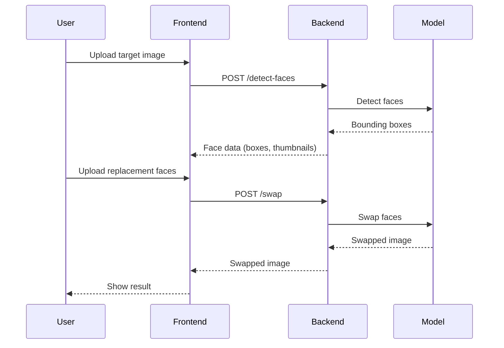
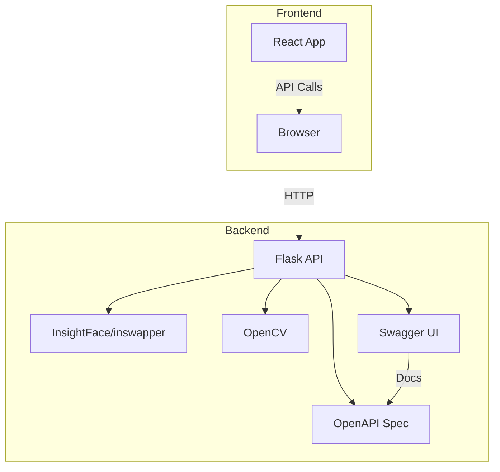

# Architecture

This project is a full-stack face swap web application using modern web and AI technologies.

## Overview
- **Frontend:** React (Vite), face-api.js for face detection, canvas for visualization.
- **Backend:** Flask (Python), InsightFace/inswapper for face swapping, OpenCV for image processing.
- **Model:** ONNX format, inswapper_128.onnx.

## Data Flow

## Deployment Diagram

## API Documentation
- [Swagger UI](http://localhost:5555/swagger) (when backend is running)
- [OpenAPI Spec](../backend/docs/openapi.yaml)

## Related Docs
- [Product Description](product.md)
- [How to Run](how-to-run.md)
- [Code Documentation](code-documentation.md)
- [Mermaid Diagrams](mermaid-examples.md)

---
For more details, see the [README](../README.md) and other docs in this folder.
