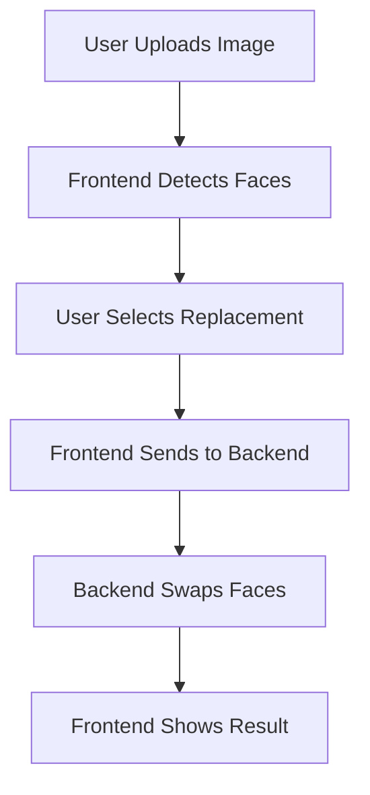
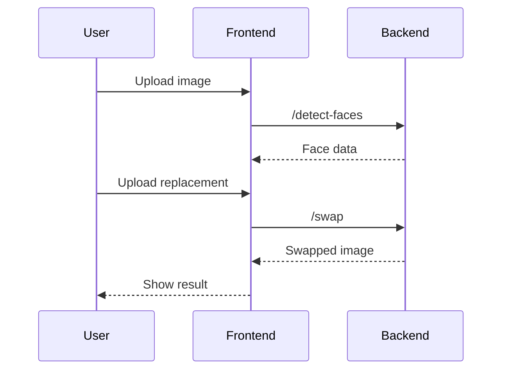
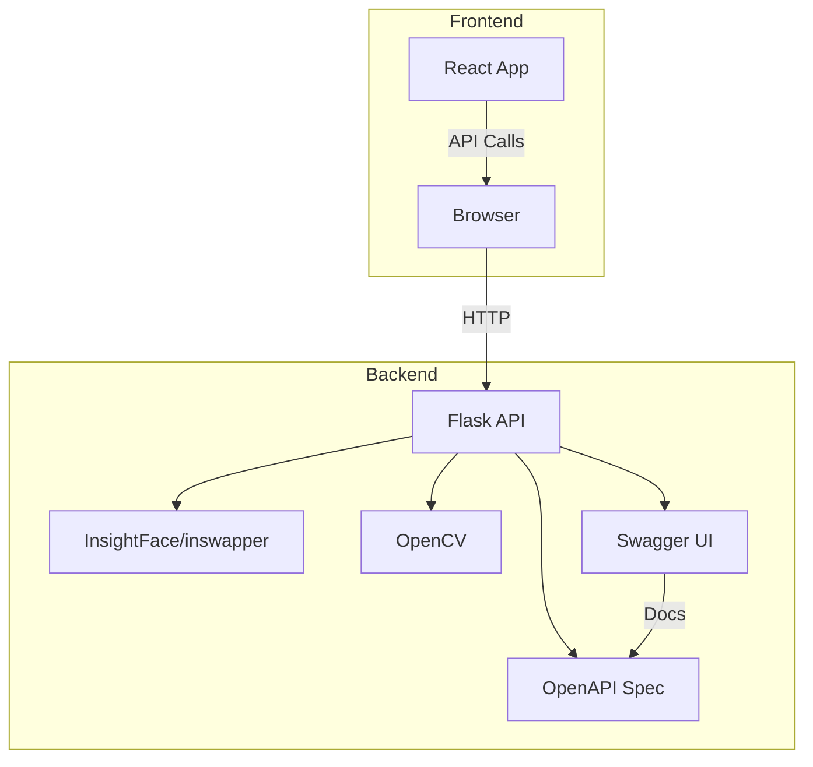

# Mermaid Diagram Examples

## Architecture Flowchart

## Sequence Diagram

## Deployment Diagram

---

## Related Docs
- [Architecture](architecture.md)
- [Product Description](product.md)
- [How to Run](how-to-run.md)
- [Code Documentation](code-documentation.md)
